# LKovariHome

Personal portfolio and Angular playground deployed at [https://lkovari.github.io/LKovariHome](https://lkovari.github.io/LKovariHome).

Originally scaffolded with Angular CLI 14; the app now runs **Angular 22.0.4** (standalone components, lazy `loadComponent` routes, signals, Vitest, PrimeNG, Angular Material, Bootstrap, and Firebase: Digits puzzles on project `numbers-55698`, knowledge-base Markdown on project `knowledgebase-store`).

---

## Tech stack

| Layer | Libraries (pinned versions) |
|-------|-----------------------------|
| Framework | **Angular 22.0.4**, RxJS 7.8, TypeScript 6.0, Zone.js 0.16 |
| UI | **Angular Material 22.0.2**, **PrimeNG 21.1.9** (`@primeng/themes` Aura), Bootstrap 5.3, Font Awesome 6, Flex Layout |
| Backend / persistence | Firebase 11.10 (`@angular/fire` 20 compat for Digits; modular SDK named app `knowledgebase` for knowledge bases), browser cookies (`ngx-cookie-service` 22) |
| Tooling | **Angular CLI 22.0.4**, ESLint flat config (`eslint.config.js`, angular-eslint 22), Vitest 4 (jsdom), pnpm 10.13, gh-pages |

Runtime Angular version is read from `@angular/core` `VERSION.full` and shown in the header via `AngularVersionComponent`.

---

## Application architecture

High-level view of bootstrap, routing, shared shell, feature areas, and external persistence.

```mermaid
flowchart TB
  subgraph bootstrap["Bootstrap (main.ts)"]
    BA["bootstrapApplication(AppComponent)"]
    PR["Providers: zone CD, router, HTTP, animations, PrimeNG Aura, GlobalErrorHandler, FaIconLibrary, provideMarkdown"]
  end

  BA --> PR
  PR --> RT["provideRouter(routes, withHashLocation)"]

  subgraph routes["Lazy routes (app.routes.ts)"]
    RT --> L["LayoutComponent<br/>portfolio pages"]
    RT --> N["AngularNewsComponent<br/>news demos"]
    RT --> D["DigitsGameComponent<br/>+ Firebase route providers"]
    RT --> M["MaterialExamplesLayoutComponent"]
    RT --> P["PlaygroundLayoutComponent"]
    RT --> X["ErrorComponent · NotFoundComponent"]
  end

  subgraph layoutChildren["Layout children"]
    L --> H["home"]
    L --> AM["about-me"]
    L --> AW["awards"]
    L --> KB["display-knowledge-base/:kind"]
  end

  subgraph newsChildren["Angular news children"]
    N --> S16["angular-news-v16-signals"]
    N --> S15["angular-news-v15-standalone"]
  end

  subgraph playgroundChildren["Playground children"]
    P --> NE["nested-example"]
    P --> CW["customizable-wizard"]
    P --> ST["slide-toggle-example"]
  end

  subgraph shared["Shared standalone components"]
    HDR["HeaderComponent"]
    SN["SidenavListComponent"]
    LC["LayoutContentComponent"]
    CHK["ChecklistComponent"]
    AV["AngularVersionComponent"]
    WS["WaitSpinnerComponent"]
  end

  L --> shared
  N --> shared
  M --> shared
  P --> shared

  subgraph digitsCore["Digits game internals"]
    D --> GSL["GameStageLevelsComponent"]
    D --> GAO["GameArithmeticOperationsComponent"]
    GSL --> SL["StageLevelComponent × 5"]
    D --> NFS["NumbersFirestoreService"]
    D --> SCS["StageCommunicationService"]
  end

  subgraph external["External persistence"]
    CK[("Cookie: CookieLKNumbers")]
    FS[("Firestore numbers-55698 /puzzledata")]
    KBFS[("Firestore knowledgebase-store /knowledgeBases + /accessLogs")]
  end

  D --> CK
  NFS --> FS
  KB --> KBFS

  subgraph errors["Error pipeline"]
    GEH["GlobalErrorHandlerService"]
    INT["httpErrorInterceptor"]
    ENS["ErrorNotificationService"]
    WSS["WaitSpinnerService refCount"]
    GEH --> ENS
    INT --> ENS
  end

  PR --> errors
  BA --> WS
  WS --> WSS
```

### Route map (hash router)

| Area | Shell / entry | Example routes |
|------|---------------|----------------|
| **Layout** | `LayoutComponent` (MatSidenav + toolbar) | `#/layout-pages/home`, `#/layout-pages/about-me`, `#/layout-pages/awards`, `#/layout-pages/display-knowledge-base/angular`, `#/layout-pages/display-knowledge-base/dotnet` |
| **Angular news** | `AngularNewsComponent` | `#/angular-news-pages/angular-news-v16-signals`, `#/angular-news-pages/angular-news-v15-standalone` |
| **Digits** | `DigitsGameComponent` | `#/digits/digits-game` |
| **Material examples** | `MaterialExamplesLayoutComponent` | `#/material-examples/components/material-examples-main` |
| **Playground** | `PlaygroundLayoutComponent` | `#/playground/components/nested-example`, `customizable-wizard`, `slide-toggle-example` |

Navigation is driven by `SidenavListComponent` (PrimeNG TieredMenu) with links to all feature areas plus an external Next.js demo.

### Bootstrap and routing (detail)

The app bootstraps as a standalone root component with hash-based routing. Feature areas are lazy-loaded standalone components registered in `app.routes.ts` under sibling empty-path routes.

---

## Layout and shared layer

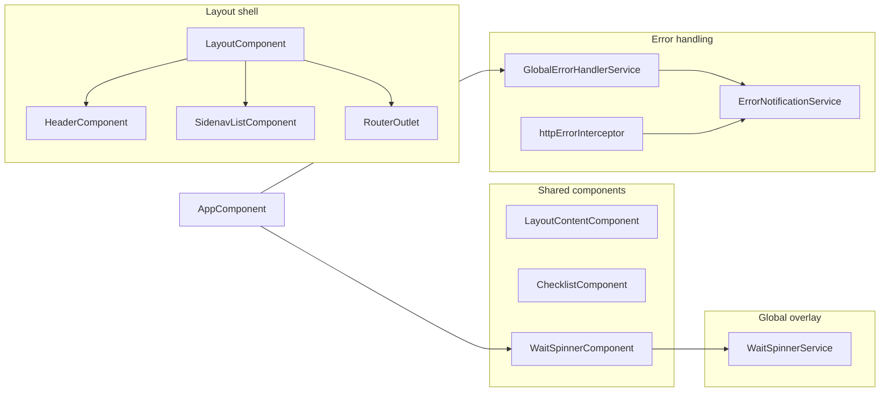

- **LayoutComponent** — responsive sidenav (Flex Layout `MediaObserver`); redirects `/` → `/layout-pages/home`.
- **Font Awesome icons** — registered via `provideFaIcons()` in `main.ts` (and test providers).
- **Error pipeline** — `GlobalErrorHandlerService` + HTTP interceptor funnel errors to `ErrorNotificationService`.
- **Global wait spinner** — see below. Hosted on `AppComponent` so it covers every route (layout, playground, digits, news).

---

## Global wait spinner

A single full-viewport overlay (`WaitSpinnerComponent` + Angular Material `mat-progress-spinner`) is shown while any caller is waiting. It is **not** tied to the knowledge-base page.

**Ref-count**

| Call | Effect |
|------|--------|
| `WaitSpinnerService.begin()` | Increment `refCount`. Overlay becomes visible when count goes from 0 → 1. |
| `WaitSpinnerService.end()` | Decrement `refCount`, never below 0. Overlay hides when count returns to 0. |

Two overlapping loads (or two features) keep the spinner up until every `begin()` has a matching `end()`. Always pair them in `try` / `finally` so errors still release the count.

```ts
private readonly waitSpinner = inject(WaitSpinnerService);

this.waitSpinner.begin();
try {
  await loadWork();
} finally {
  this.waitSpinner.end();
}
```

- Service: `src/app/shared/services/wait-spinner/wait-spinner.service.ts` (`providedIn: 'root'`).
- UI: `src/app/shared/components/wait-spinner/`.
- Mounted in `app.component.html` next to `<router-outlet />`.

The knowledge-base Markdown fetch already uses this spinner.

---

## Knowledge base (Firestore)

Home links **Modern Angular** and **.Net C#** open `#/layout-pages/display-knowledge-base/angular` and `…/dotnet`. Content is **not** shipped in `src/assets`. The Markdown strings live in Firebase project **`knowledgebase-store`** (Spark), Firestore collection `knowledgeBases`, documents `angular` and `dotnet` (fields `markdown`, `locale`, `updatedAt`).

### Email gate

Opening either knowledge base **requires an email address** before the Markdown is fetched.

- The first screen is a Material form: label **Email**, Continue.
- Validation uses Angular **`Validators.required`** and **`Validators.email`** (built-in; not a custom regex). Empty → “Email is required.” Invalid shape → “Please enter a valid email address.”
- Continue then looks up **MX** records for the domain via DNS-over-HTTPS (Cloudflare, Google DNS fallback). No usable MX (including NXDOMAIN and RFC 7505 null MX) → “This email domain cannot receive mail. Please use an address on a domain that accepts email.” Lookup timeout / DNS failure / offline show a retryable verify error; the spinner covers the wait (capped at 8 s).
- A passing address is stored in `sessionStorage` under `knowledgeBaseEmail` for the **current tab**. Angular and .NET in the same tab do not ask twice. Closing the tab clears it. Restoring from `sessionStorage` does not repeat the MX lookup.
- After Continue, `accessLogs` gets a new document: `email`, `locale` (`navigator.language`), `knowledgeBaseId` (`angular` | `dotnet`), `viewedAt` (`serverTimestamp()`). Clients may **create** logs only; they cannot read other visitors’ emails (`allow read: if false` on `accessLogs`).
- MX proves the **domain** can receive mail, not that the local part exists (`lala@gmail.com` can still pass). There is no Firebase Auth confirmation link.

### Load and render

1. `KnowledgeBaseFirestoreService` (modular Firebase named app `knowledgebase`) reads `knowledgeBases/{kind}` with a **network-aware timeout**.
2. `ngx-markdown` renders the string (Pandoc `{#slug}` ToC + in-panel hash scrolling; see `CHANGELOG.md`).
3. The global wait spinner runs only while Firestore is fetching Markdown (`begin` / `finally end`). Access logging does not keep the spinner up.

**Timeouts** (Network Information API `effectiveType`; 5G is not a separate type, so downlink ≥ 10 Mbps on `4g` is treated as 5G-class):

| Network | Max wait, then spinner off + error |
|---------|--------------------------------------|
| Offline | Immediate |
| slow-2g | 60 s |
| 2g or Save-Data | 45 s |
| 3g | 20 s |
| 4g | 12 s |
| 5G-class (`4g` + downlink ≥ 10) | 8 s |
| Unknown / no API | 15 s |

**Load error messages** (Retry is always offered):

| Cause | Message |
|-------|---------|
| Offline | You appear to be offline. Check your connection and try again. |
| Timeout | The knowledge base took too long to load on this network. Check your connection and try again. |
| Document missing | The knowledge base was not found. |
| Permission denied | The knowledge base could not be loaded (permission denied). |
| Unavailable / deadline | The knowledge base could not be loaded. Check your connection and try again. |
| Other | The knowledge base could not be loaded. Please try again. |

Helper: `src/app/shared/services/network-load/network-load-timeout.ts` (`networkLoadTimeoutMs`, `withTimeout`).

Digits puzzles stay on Firebase project `numbers-55698`. Do not replace `firebasePuzzleData` with the knowledge-base config.

Learning Check, Labyrinth, Mersenne, and About Me files remain under `src/assets/bigfiles/`. Only the two knowledge-base `.md` sources were removed from the repo.

---

## Playground (dynamic wizard)

Experimental UI patterns live under the playground route tree.

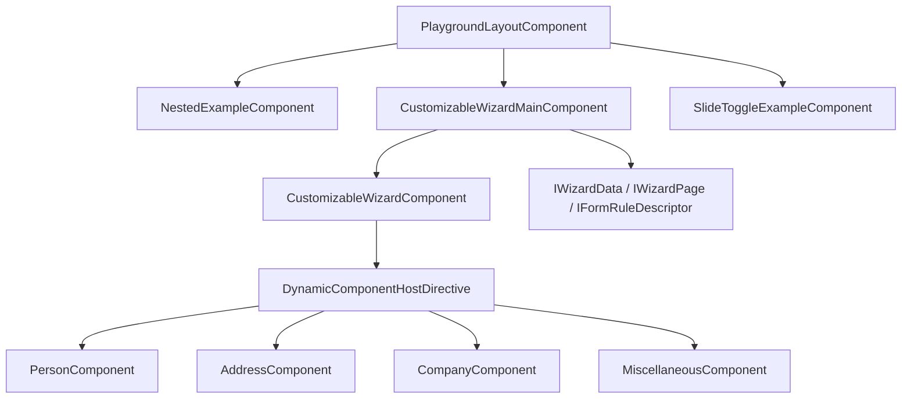

The customizable wizard builds pages from `IWizardPage` descriptors and mounts step components dynamically via `ViewContainerRef` (`DynamicComponentHostDirective`).

---

## Digits game — deep architecture

Daily arithmetic puzzle (inspired by NY Times Digits). Five stages per day; each stage presents six numbers and a target. The player combines numbers with `+`, `-`, `×`, `/` until the target is reached.

### Route and providers

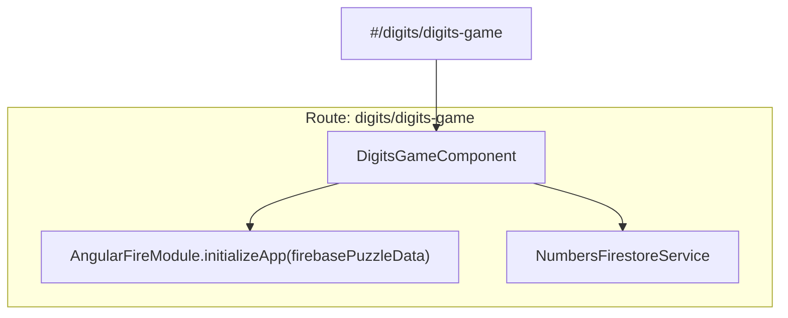

**Imports:** PrimeNG Toast/Dialog, Material Icon, Clipboard, FlexLayout, AngularFirestore compat.  
**Providers:** `NumbersFirestoreService` (also `providedIn: 'root'`).

---

### Component tree and UI flow

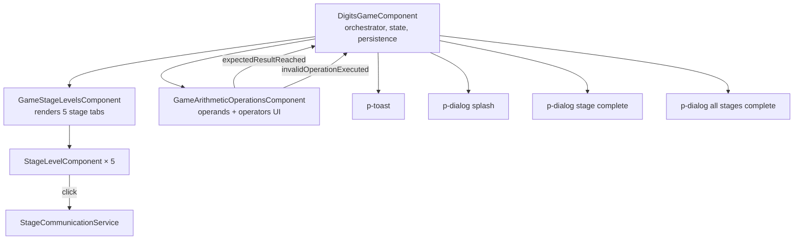

| Component | Responsibility |
|-----------|----------------|
| **DigitsGameComponent** | Game lifecycle: init from cookie/DB, stage index, modals, cookie/Firestore sync, clipboard summary |
| **GameStageLevelsComponent** | Validates exactly 5 `IStageLevel` items; lays out stage indicators |
| **StageLevelComponent** | Single stage pill (selected / completed / value); emits click via `StageCommunicationService` |
| **GameArithmeticOperationsComponent** | Operand/operator buttons, undo stack, operation history, animations; emits win or invalid op |

---

### DigitsGameComponent — initialization sequence

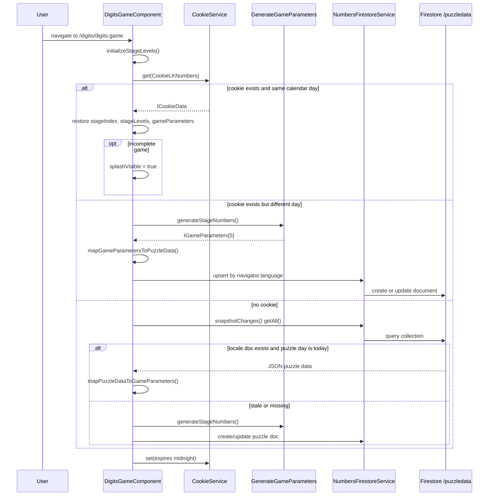

---

### GameArithmeticOperationsComponent — operation flow

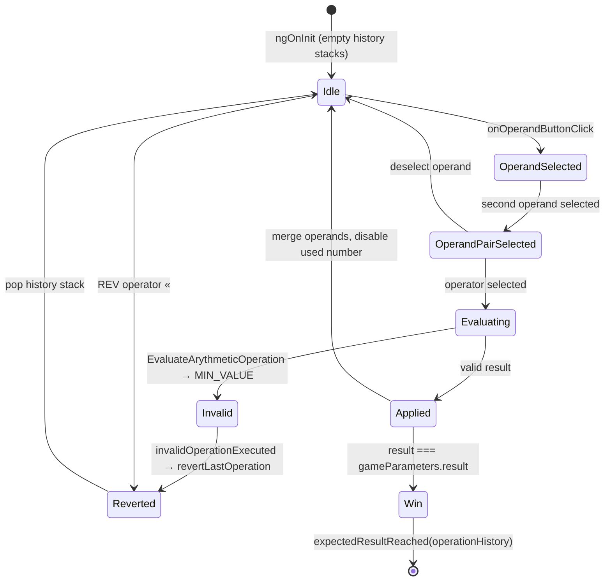

**Stacks inside `GameArithmeticOperationsComponent`:**

- `history: Stack<IGameParameters>` — snapshots for undo (`«` revert).
- `operationHistory: Stack<IGameOperation>` — ordered list of executed ops for victory summary.

---

### Services

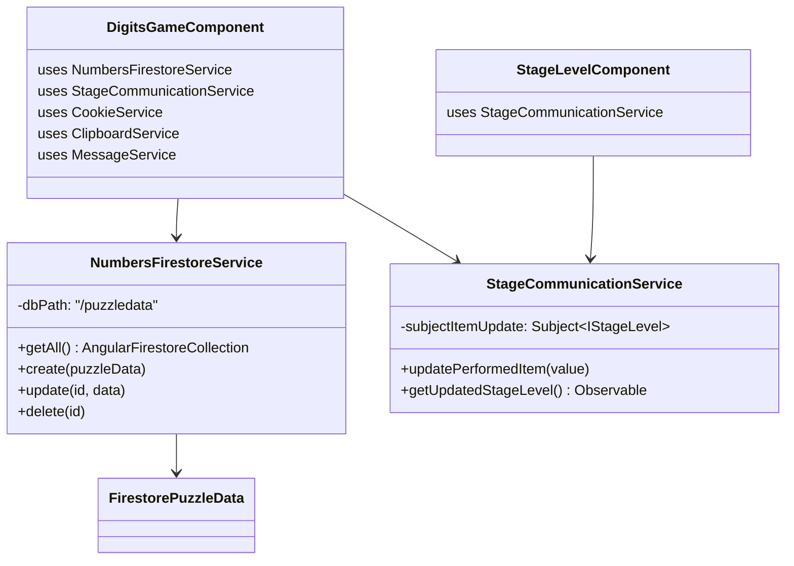

| Service | Scope | Role |
|---------|-------|------|
| **NumbersFirestoreService** | route + root | CRUD on Firestore collection `/puzzledata`; stores locale-keyed JSON puzzle payloads |
| **StageCommunicationService** | root | RxJS `Subject` bridge when a stage tab is clicked (observed in `DigitsGameComponent`) |

---

### Domain models (Digits)

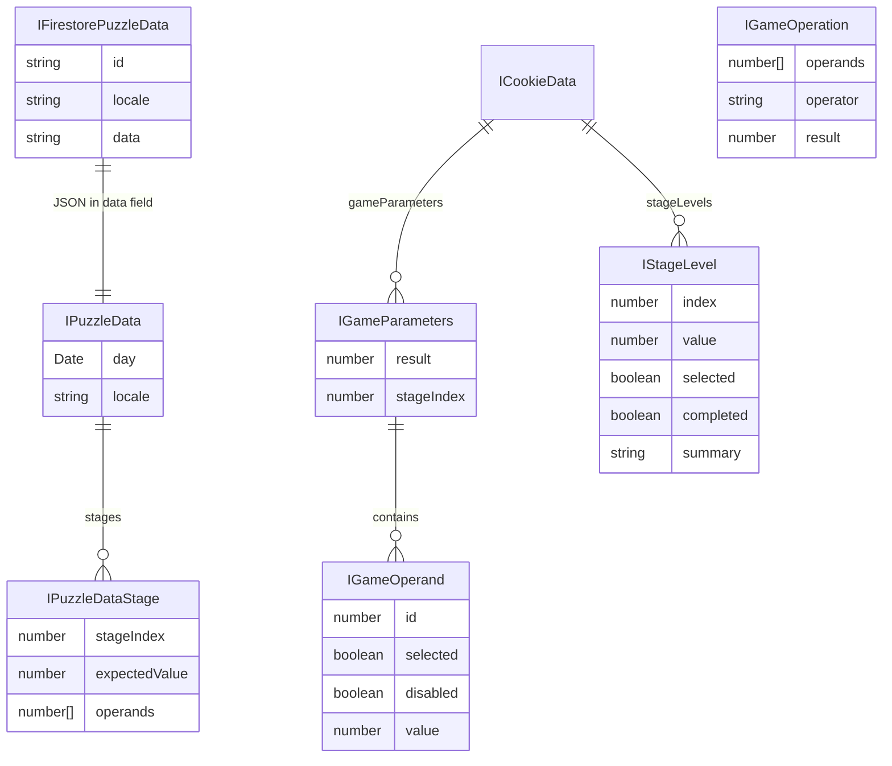

**Implementation classes:** `GameParameters`, `GameOperand`, `StageLevel`, `PuzzleData`, `PuzzleDataStage`, `FirestorePuzzleData`, `CookieData`, `GameOperation`, `Stack<T>`.

**Interfaces:** mirror models (`IGameParameters`, `IGameOperand`, `IStageLevel`, etc.) plus `IStack<T>`.

---

### Utilities and constants

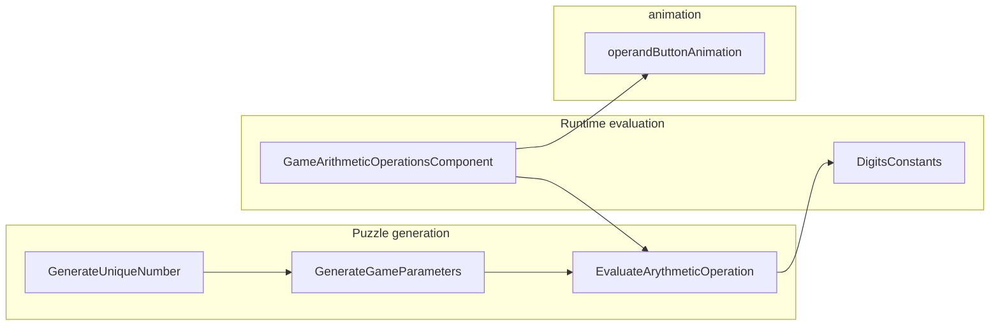

| File | Purpose |
|------|---------|
| `digits-constants.ts` | Operator symbols: `«`, `+`, `-`, `×`, `/` |
| `generate-unique-number.ts` | Non-repeating random integers in a range |
| `generate-game-parameters.ts` | Builds 5 stages: random operands per difficulty band, simulates valid ops to derive target, sorts stages by ascending target |
| `evaluate-arythmetic-operation.ts` | Static `evaluate()` and `cloneGameParameters()`; invalid sub/div returns `Number.MIN_VALUE` |
| `operand-button-animation.ts` | Angular animation trigger on operand buttons |

**Stage difficulty (GenerateGameParameters):** operand ranges and target bounds tighten per `stageIndex` (0–4); results sorted ascending so stage tabs show increasing targets.

---

### Persistence model

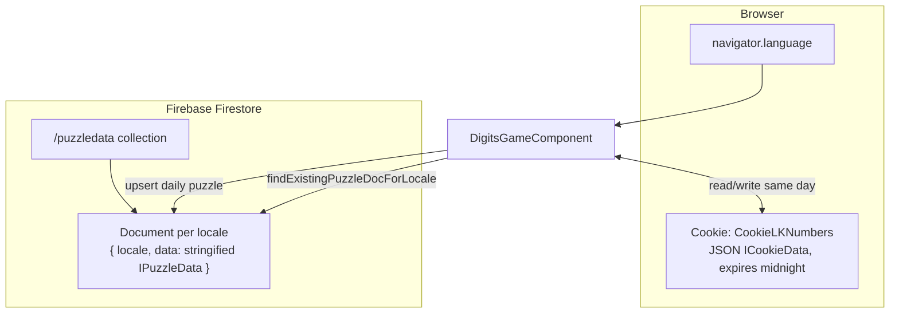

- **Cookie** — fast same-day resume (stage progress, parameters, completion flag).
- **Firestore** — shared daily puzzle per locale; `findExistingPuzzleDocForLocale` matches exact tag or primary language subtag.
- **Clipboard** — stage/all-stage operation summaries via `ngx-clipboard`.

---

### Digits file map

```
src/app/digits/
├── digits-game.component.{ts,html,scss}
├── digits-constants.ts
├── generate-game-parameters.ts
├── generate-unique-number.ts
├── digit-styles.scss
├── components/
│   ├── game-stage-levels/
│   ├── stage-level/
│   └── game-arithmetic-operations/
│       ├── evaluate-arythmetic-operation.ts
│       └── operand-button-animation.ts
├── models/          # interfaces + model classes (puzzle, game, cookie, stack)
└── services/
    ├── numbers-firestore.service.ts
    └── stage-communication.service.ts
```

---

## Source layout (full app)

```
src/
├── main.ts                    # bootstrapApplication + providers
├── app/
│   ├── app.component.ts
│   ├── app.routes.ts          # lazy loadComponent routes + route providers
│   ├── layout/                # portfolio shell (home, about, awards)
│   ├── layout-pages/          # routed page components
│   ├── angular-news/          # news shell + lazy news pages
│   ├── angular-news-pages/
│   ├── digits/                # numbers puzzle (see above)
│   ├── material-examples/
│   ├── playground/
│   ├── shared/                # header, sidenav, checklist, error services
│   ├── error/
│   └── not-found/
├── assets/                    # icons, logos, CV PDF
├── environments/              # Firebase config (prod/dev)
└── styles/
```

---

## Development server

Run `pnpm start` or `ng serve`. Navigate to `http://localhost:4200/`. The app uses hash routing (`#/...`).

Run `pnpm lint` to execute ESLint via the flat config.

## Code scaffolding

Run `ng generate component component-name` to generate a new component. You can also use `ng generate directive|pipe|service|class|guard|interface|enum|module`.

## Build

Run `ng build` to build the project. Artifacts go to `dist/`.

Production GitHub Pages build:

```bash
pnpm gitbuild   # ng build --configuration production --base-href /LKovariHome/
pnpm gitdeploy  # gh-pages -d dist
```

## Running unit tests

Run `pnpm test` or `ng test` to execute unit tests with [Vitest](https://vitest.dev) via the Angular `@angular/build:unit-test` builder. See [Tests](#tests) for setup details, coverage, and what is covered.

For a single CI-style run:

```bash
ng test --no-watch
ng test --no-watch --coverage
```

## Running end-to-end tests

Run `ng e2e` to execute end-to-end tests via a platform of your choice. To use this command, you need to first add a package that implements end-to-end testing capabilities.

## Further help

To get more help on the Angular CLI use `ng help` or see the [Angular CLI overview](https://angular.dev/tools/cli).

---

## Upgrade

The project is on **Angular 22.0.4**; the v21 → v22 upgrade and codemods are complete (see [Result](#result)).

### v21 → v22

Angular ships **codemods** (automated refactors) with each major release. After bumping `@angular/*` packages to v22, the codebase must be updated to match new defaults and breaking changes.

The usual path is:

```bash
ng update @angular/core@22 @angular/cli@22
```

That can fail or skip migrations when dependency trees are complex (for example `@angular/fire`, PrimeNG, or legacy Flex Layout), the git working tree is dirty, or `ng update` does not run every named migration reliably.

This repo includes a **manual, one-time migration runner** that applies all official Angular v22 codemods in a fixed order. It is **not** part of `start`, `build`, `test`, CI, or deployment — only a developer runs it during the upgrade.

#### Run the migrations

1. Install dependencies: `pnpm install`
2. Run: `pnpm run migrate:angular-v22`

That executes `scripts/run-v22-migrations-direct.cjs`, which loads migration schematics directly from `node_modules` and writes file changes to the workspace. After it finishes, review the diff and commit.

#### Migrations applied

| Package | Migration | Typical changes |
|---------|-----------|-----------------|
| `@angular/core` | `change-detection-eager` | Adds `changeDetection: ChangeDetectionStrategy.Eager` to components |
| `@angular/core` | `http-xhr-backend` | Updates HTTP test setup to `provideHttpClient(withXhr())` in test providers |
| `@angular/core` | `strict-templates-default` | Enables `strictTemplates: true` in `tsconfig.json` |
| `@angular/core` | `can-match-snapshot-required` | Route guard / `canMatch` API updates where applicable |
| `@angular/core` | `incremental-hydration` | SSR/hydration-related updates where applicable |
| `@angular/core` | `strict-safe-navigation-narrow` | Template strictness for safe navigation |
| `@angular/core` | `model-output` | `model()` input/output API updates where applicable |
| `@angular/core` | `safe-optional-chaining` | Template optional-chaining strictness updates |
| `@angular/cli` | `add-istanbul-instrumenter` | Coverage / `istanbul-lib-instrument` dev dependency alignment |
| `@angular/cli` | `update-workspace-config` | Updates `tsconfig.*.json`, `angular.json`, and related workspace files |

#### Migration scripts in `scripts/`

| File | Role |
|------|------|
| `run-v22-migrations-direct.cjs` | **Used by `pnpm run migrate:angular-v22`.** Invokes `@angular/core` and `@schematics/angular` migration bundles via Angular DevKit, without going through the CLI. |
| `run-v22-migrations.mjs` | Alternative: loops `ng update @angular/core@22 --name <migration> --allow-dirty` (and the same for `@angular/cli`). Not wired in `package.json`. |
| `run-v22-migrations-via-ng.mjs` | Same as `run-v22-migrations.mjs`; kept as an alternate CLI-based runner. Not wired in `package.json`. |

Use the direct `.cjs` script when `ng update` is unreliable. Use an `.mjs` variant only if you prefer the CLI path and want to run it manually with `node scripts/run-v22-migrations.mjs`.

#### After upgrading

- Run `pnpm build` and `pnpm test` to verify the tree.
- Resolve any remaining peer-dependency or third-party library issues by hand (`ng update` alone rarely fixes all of them).
- You do not need to run `migrate:angular-v22` again unless you reset the repo or repeat the v21 → v22 upgrade on another branch.
- See [Result](#result) for post-upgrade verification output.

### Result

Post-upgrade verification on **2026-06-26** (Angular **22.0.4**, package manager **pnpm**).

#### `npm outdated`

> **Note:** `npm outdated` was run against a pnpm workspace. The warnings about `node-linker` and `public-hoist-pattern` come from pnpm-specific settings in `.npmrc` — they are expected when using npm instead of pnpm. Prefer `pnpm outdated` in this repo.

For several `@angular/*` packages, **Current (22.0.4) is newer than Latest** in the registry column. That is normal while npm's "latest" tag still points at Angular 21; the project is intentionally on v22.

```
$ npm outdated
npm warn Unknown project config "node-linker". This will stop working in the next major version of npm.
npm warn Unknown project config "public-hoist-pattern". This will stop working in the next major version of npm.

Package                              Current   Wanted   Latest  Location
@angular/animations                   22.0.4   22.0.4   20.1.8  node_modules/@angular/animations
@angular/build                        22.0.4   22.0.4  21.2.17  node_modules/@angular/build
@angular/cli                          22.0.4   22.0.4  21.2.17  node_modules/@angular/cli
@angular/common                       22.0.4   22.0.4  21.2.17  node_modules/@angular/common
@angular/compiler                     22.0.4   22.0.4  21.2.17  node_modules/@angular/compiler
@angular/compiler-cli                 22.0.4   22.0.4  21.2.17  node_modules/@angular/compiler-cli
@angular/core                         22.0.4   22.0.4  21.2.17  node_modules/@angular/core
@angular/forms                        22.0.4   22.0.4  21.2.17  node_modules/@angular/forms
@angular/platform-browser             22.0.4   22.0.4  21.2.17  node_modules/@angular/platform-browser
@angular/platform-browser-dynamic     22.0.4   22.0.4   20.0.7  node_modules/@angular/platform-browser-dynamic
@angular/router                       22.0.4   22.0.4  21.2.17  node_modules/@angular/router
@eslint/js                            9.39.4   9.39.4   10.0.1  node_modules/@eslint/js
@fortawesome/fontawesome-svg-core      6.7.2    6.7.2    7.3.0  node_modules/@fortawesome/fontawesome-svg-core
@fortawesome/free-brands-svg-icons     6.7.2    6.7.2    7.3.0  node_modules/@fortawesome/free-brands-svg-icons
@fortawesome/free-regular-svg-icons    6.7.2    6.7.2    7.3.0  node_modules/@fortawesome/free-regular-svg-icons
@fortawesome/free-solid-svg-icons      6.7.2    6.7.2    7.3.0  node_modules/@fortawesome/free-solid-svg-icons
@primeuix/styles                       1.2.5    1.2.5    2.0.3  node_modules/@primeuix/styles
@primeuix/utils                        0.6.4    0.6.4    0.7.2  node_modules/@primeuix/utils
@schematics/angular                   22.0.4   22.0.4  21.2.17  node_modules/@schematics/angular
eslint                                9.39.4   9.39.4   10.6.0  node_modules/eslint
firebase                             11.10.0  11.10.0  12.15.0  node_modules/firebase
jsdom                                 26.1.0   26.1.0   26.1.0  node_modules/jsdom
vitest                                 4.1.9    4.1.9    4.1.9   node_modules/vitest
```

**Summary:** Angular packages are pinned at **22.0.4** and match **Wanted**. Optional future major bumps (not required for v22): ESLint 10, Font Awesome 7, Firebase 12, `@primeuix/styles` 2.x. Unit tests use **Vitest** (Karma/Jasmine removed); see [Migrations](#migrations) and [Tests](#tests).

#### `ng update`

```
$ ng update
Using package manager: pnpm
Collecting installed dependencies...
Found 647 dependencies.
    We analyzed your package.json and everything seems to be in order. Good work!
```

**Conclusion:** The v21 → v22 upgrade and migrations are complete; no further Angular CLI updates are pending.

---

## Migrations

Current migration status for this repository. Completed items are verified with `pnpm build` and `pnpm test -- --no-watch`.

| Track | Status | Notes |
|-------|--------|-------|
| Angular 14 → **22.0.4** | **Complete** | On **22.0.4**; application build system (`@angular/build:application`) |
| v21 → v22 codemods | **Complete** | Applied via `pnpm run migrate:angular-v22`; see [Upgrade](#upgrade) |
| Karma / Jasmine → Vitest | **Complete** | `@angular/build:unit-test`, Vitest 4, jsdom; Karma config removed |
| NgModules → standalone | **Complete** | `bootstrapApplication`, `app.routes.ts`, lazy `loadComponent`; zero `*.module.ts` files |
| `@angular/flex-layout` | **Pending** | Still used for responsive layout; library is deprecated — replace with modern CSS when feasible |
| `@angular/fire` compat API | **Pending** | Digits game uses compat Firestore; migrate to modular Firebase API when upgrading `@angular/fire` |
| PrimeNG `@primeng/themes` | **Pending** | Package deprecated in favour of `@primeuix/themes` |

### Angular 22.0.4 upgrade notes

- **Done:** TypeScript 6.0, strict templates, eager change detection on components, HTTP client with `withXhr()`, workspace `angular.json` aligned with the application builder.
- **Script:** `pnpm run migrate:angular-v22` runs `scripts/run-v22-migrations-direct.cjs` (one-time; do not re-run unless repeating the upgrade on a fresh branch).
- **Details:** Full migration list and verification output are under [Upgrade](#upgrade) and [Result](#result).

### Test runner (Karma → Vitest)

| Removed | Added / updated |
|---------|-----------------|
| `karma.conf.js`, `src/test.ts` | `src/test-providers.ts` — global TestBed providers (router, HTTP, animations, Font Awesome) |
| `karma`, `karma-*`, `jasmine-core`, `@types/jasmine` | `vitest`, `jsdom`, `@vitest/coverage-v8` |
| `@angular/build:karma` test target | `@angular/build:unit-test` in `angular.json` |
| `tsconfig.spec.json` types: `jasmine` | `vitest/globals` |

Global test bootstrap moved from `src/test.ts` into Angular’s Vitest builder plus `providersFile` / `setupFiles`. The builder reuses the **development** build configuration (`buildTarget: LKovariHome:build:development`) instead of duplicating styles and assets on the test target.

### Standalone components and routing

- **Done:** Standalone root bootstrap in `main.ts`, lazy `loadComponent` routes in `app.routes.ts`, hash-based routing with `withHashLocation()`. All NgModule and routing-module files removed.
- **Not migrated:** End-to-end tests — no e2e runner is configured (`ng e2e` is not set up).

### Official Angular migrations ([angular.dev/reference/migrations](https://angular.dev/reference/migrations))

Status for this repository after standalone, Vitest, and partial signal/API modernisation. Run remaining schematics with `ng generate @angular/core:<name>`.

| Migration | Status | Notes |
|-----------|--------|-------|
| [Standalone](https://angular.dev/reference/migrations/standalone) | **Complete** | No `@NgModule`; routes in `app.routes.ts` |
| [Control flow syntax](https://angular.dev/reference/migrations/control-flow) | **Complete** | Templates use `@if` / `@for`; no `*ngIf` / `*ngFor` |
| [Lazy-loaded routes](https://angular.dev/reference/migrations/route-lazy-loading) | **Complete** | All feature entry points use `loadComponent` |
| [Outputs (`output()`)](https://angular.dev/reference/migrations/outputs) | **Complete** | No `@Output()` decorators |
| [Signal queries](https://angular.dev/reference/migrations/signal-queries) | **Complete** | `viewChild()` / `viewChild.required()` throughout |
| [RouterTestingModule](https://angular.dev/reference/migrations/router-testing-module-migration) | **Complete** | Specs use `provideRouter` / standalone `imports` |
| [CommonModule → standalone imports](https://angular.dev/reference/migrations/common-module) | **Complete** | N/A — no NgModules remain |
| [NgStyle → style bindings](https://angular.dev/reference/migrations/ngstyle-to-style) | **Complete** | No `ngStyle` / `NgStyle` in source |
| [NgClass → class bindings](https://angular.dev/reference/migrations/ngclass-to-class) | **Complete** | All `[ngClass]` converted to `[class.xxx]` |
| [Signal inputs (`input()`)](https://angular.dev/reference/migrations/signal-inputs) | **Complete** | All components use `input()`; custom widgets use `FormValueControl` / `FormCheckboxControl` |
| [inject() function](https://angular.dev/reference/migrations/inject-function) | **Complete** | Migration applied; empty constructors are backwards-compat stubs |
| [Self-closing tags](https://angular.dev/reference/migrations/self-closing-tags) | **Mostly complete** | App templates use self-closing tags; optional cleanup in non-Angular HTML |
| [Cleanup unused imports](https://angular.dev/reference/migrations/cleanup-unused-imports) | **Complete** | Schematic run; no unused imports in tsconfig.app or tsconfig.spec |

---

## Tests

Unit tests run with **Vitest** through Angular CLI’s **`@angular/build:unit-test`** builder (the default direction for new Angular projects from v21 onward).

### Why Vitest instead of Karma

| Topic | Karma + Jasmine (before) | Vitest (now) |
|-------|--------------------------|--------------|
| Runtime | Real browser (Chrome) via Karma | **jsdom** in Node by default — no browser startup |
| Speed | Full rebuild + browser launch per run | Typically **much faster** feedback (~2s for this suite) |
| CLI integration | Separate Karma config and `test.ts` bootstrap | Builder owns config; optional `providersFile` / `setupFiles` only |
| Watch mode | Karma `autoWatch` | `ng test` watch in TTY; `ng test --no-watch` for CI |
| Coverage | `karma-coverage` | `ng test --coverage` with `@vitest/coverage-v8` |
| API | Jasmine `describe` / `it` / `expect` | Same globals via `vitest/globals` in `tsconfig.spec.json` |
| Maintenance | Karma is deprecated in the Angular ecosystem | Aligns with [Angular’s Vitest migration guide](https://angular.dev/guide/testing/migrating-to-vitest) |

Vitest fits this project because most specs are component and service smoke tests plus a growing set of **behaviour-focused** tests; they do not require a real browser unless you later opt into `@vitest/browser-playwright`. Angular **22.0.4** projects use the `@angular/build:unit-test` builder by default (replacing Karma from earlier majors).

### Configuration

| File | Role |
|------|------|
| `angular.json` → `architect.test` | Builder `@angular/build:unit-test`, `providersFile`, `setupFiles`, coverage reporters |
| `tsconfig.spec.json` | `vitest/globals`; includes `*.spec.ts` and test helper files |
| `src/test-providers.ts` | Default router stubs, `provideHttpClientTesting`, noop animations, Font Awesome initializer |
| `src/test-setup.ts` | `window.matchMedia` polyfill for Flex Layout and PrimeNG in jsdom |

**Requirements:** Node **v22.22.3+**, **v24.15.0+**, or **v26+** (Angular CLI 22). Use `nvm use` if `ng test` reports an unsupported Node version.

### What is tested (38 spec files, 58 tests)

Tests favour **observable behaviour** over empty “should create” checks where the component has real logic. Many playground and digits specs remain minimal smoke tests for demo components.

#### Routing (`app.routes.spec.ts`)

- Route table: layout pages, digits (Firebase providers), playground, angular news, wildcard redirect to `not-found`
- Navigation: URL resolution for home, about-me, awards, error, and unknown paths redirecting to `not-found`

#### Layout pages

| Spec | Behaviour covered |
|------|-------------------|
| `home.component.spec.ts` | Copyright year; welcome text in the DOM |
| `about-me.component.spec.ts` | Profile asset paths; copyright year; profile image and CV link |
| `awards.component.spec.ts` | Eight award entries; priority image metadata; alt text rendered |
| `layout.component.spec.ts` | Redirect `/` → `/layout-pages/home`; no redirect on other URLs; `isScreenXs()` |

#### Error handling and shell pages

| Spec | Behaviour covered |
|------|-------------------|
| `error.component.spec.ts` | Empty error log vs. entries from `ErrorNotificationService` |
| `not-found.component.spec.ts` | 404 heading and message |
| `global-error-handler.service.spec.ts` | Runtime errors forwarded to the notification service |
| `app.component.spec.ts` | App bootstrap and title |

#### Angular news demo

| Spec | Behaviour covered |
|------|-------------------|
| `angular-news-v16-signals.component.spec.ts` | Signal-derived amount (`payment × quantity − writeoff`); form sync to disabled amount control; invalid state when required fields empty |

#### Smoke tests (create / wiring only)

Remaining specs mostly assert that components, services, interceptors, and playground wizard steps compile and instantiate: digits game subtree, material examples, playground layouts, shared header/sidenav/checklist/slide-toggle, and customizable-wizard data-source components.

### Possible follow-ups

- Replace smoke-only specs with behaviour tests where components gain non-trivial logic (digits game stages, wizard validation, Firestore service).
- Add `@vitest/browser-playwright` only if a test truly needs a real browser APIs beyond jsdom.
- Introduce e2e tests (Playwright/Cypress) for full hash-router flows — not covered by unit tests today.

---

## Known bugs and/or To Do List

- Generating index html...1 rules skipped due to selector errors: legend+\* -> Cannot read property 'type' of undefined
- set to true : "strictPropertyInitialization": false,
- use date pipe at lastUpdateDate
- Digits: share copy to clipboard does not work reliably
- Digits: Firestore locale query could use dedicated queries instead of full collection scan

## Would be good or better

- hidden side nav when press the hamburger (menu) icon floating above the content, instead of shift right the content

## Original values which changed.

-1. angular.json production build
"maximumWarning": "500kb",
"maximumError": "1mb"

-2. angular.json below the production added
"optimization": {
"scripts": true,
"styles": {
"minify": true,
"inlineCritical": false
},
"fonts": true
},
to eliminate the following warning
Generating index html...1 rules skipped due to selector errors: legend+\* -> Cannot read property 'type' of undefined

-3. angular.json architect\build\options\styles
replaced "node_modules/bootstrap/scss/bootstrap.css" with "node_modules/bootstrap/scss/bootstrap.scss",

-4. added "preserveSymlinks": true, to prevent:
main.ts:11 ERROR Error: NG0203: inject() must be called from an injection context such as a constructor, a factory function, a field initializer, or a function used with `runInInjectionContext`. Find more at https://angular.dev/errors/NG0203

## Deployed to https://lkovari.github.io/LKovariHome
