# LKovariHome

Personal portfolio and Angular playground deployed at [https://lkovari.github.io/LKovariHome](https://lkovari.github.io/LKovariHome).

Originally generated with Angular CLI 14; currently on **Angular 22** with standalone components, lazy-loaded feature modules, PrimeNG, Angular Material, Bootstrap, and Firebase (Digits game persistence).

---

## Tech stack

| Layer | Libraries |
|-------|-----------|
| Framework | Angular 22.0.4, RxJS 7, TypeScript 6.0 |
| UI | Angular Material 22, PrimeNG 21 (`@primeng/themes` Aura), Bootstrap 5, Font Awesome, Flex Layout |
| Backend / persistence | Firebase Firestore (`@angular/fire` compat), browser cookies (`ngx-cookie-service`) |
| Tooling | Angular CLI, ESLint flat config (`eslint.config.js`, angular-eslint 22), Karma/Jasmine, pnpm 10, gh-pages |

---

## Application architecture (top level)

The app bootstraps as a standalone root component with hash-based routing. Feature areas are lazy-loaded NgModules that register sibling routes under the empty path.

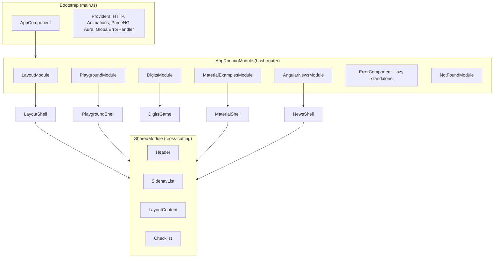

### Feature modules and routes

| Module | Shell / entry | Example routes |
|--------|---------------|----------------|
| **LayoutModule** | `LayoutComponent` (MatSidenav + toolbar) | `#/layout-pages/home`, `#/layout-pages/about-me`, `#/layout-pages/awards` |
| **AngularNewsModule** | `AngularNewsComponent` | `#/angular-news-pages/angular-news-v16-signals`, `#/angular-news-pages/angular-news-v15-standalone` |
| **DigitsModule** | `DigitsGameComponent` | `#/digits/digits-game` |
| **MaterialExamplesModule** | `MaterialExamplesLayoutComponent` | `#/material-examples/components/material-examples-main` |
| **PlaygroundModule** | `PlaygroundLayoutComponent` | `#/playground/components/nested-example`, `customizable-wizard`, `slide-toggle-example` |

Navigation is driven by `SidenavListComponent` (PrimeNG TieredMenu) with links to all feature areas plus an external Next.js demo.

---

## Layout and shared layer

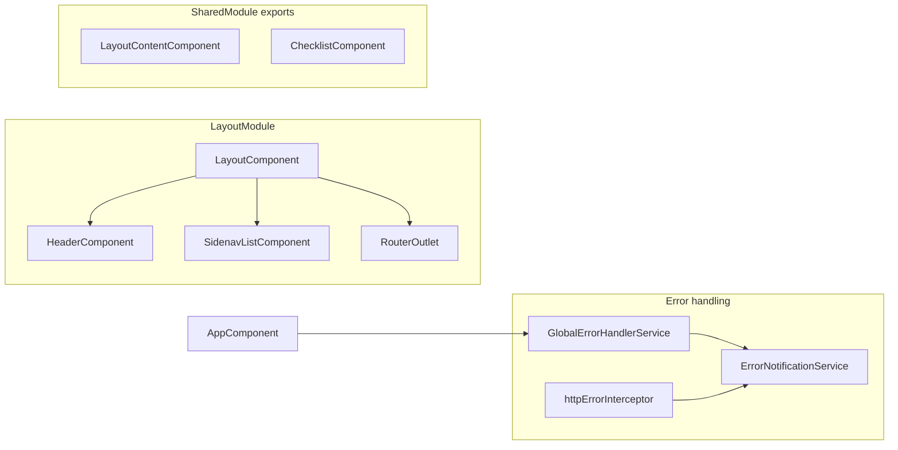

- **LayoutComponent** — responsive sidenav (Flex Layout `MediaObserver`); redirects `/` → `/layout-pages/home`.
- **SharedModule** — registers Font Awesome icons; exports header, sidenav, checklist, FlexLayout, Menubar.
- **Error pipeline** — `GlobalErrorHandlerService` + HTTP interceptor funnel errors to `ErrorNotificationService`.

---

## Playground module (dynamic wizard)

Experimental UI patterns live under `PlaygroundModule`.

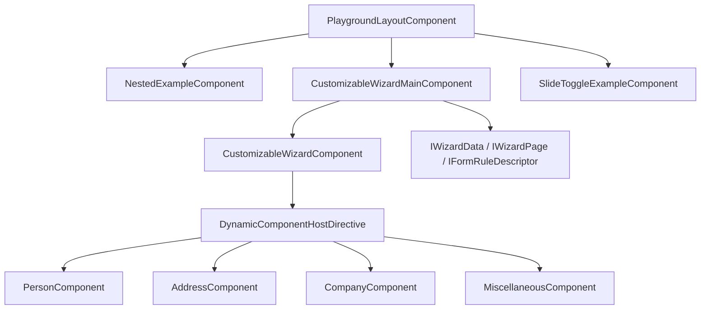

The customizable wizard builds pages from `IWizardPage` descriptors and mounts step components dynamically via `ViewContainerRef` (`DynamicComponentHostDirective`).

---

## Digits module — deep architecture

Daily arithmetic puzzle (inspired by NY Times Digits). Five stages per day; each stage presents six numbers and a target. The player combines numbers with `+`, `-`, `×`, `/` until the target is reached.

### Module boundary

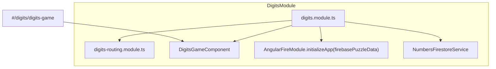

**Imports:** PrimeNG Toast/Dialog, Material Icon, Clipboard, FlexLayout, AngularFirestore compat.  
**Providers:** `NumbersFirestoreService` (also `providedIn: 'root'`).

---

### Component tree and UI flow

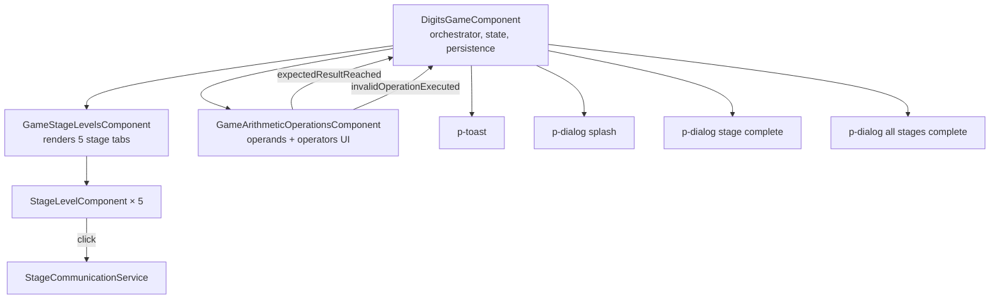

| Component | Responsibility |
|-----------|----------------|
| **DigitsGameComponent** | Game lifecycle: init from cookie/DB, stage index, modals, cookie/Firestore sync, clipboard summary |
| **GameStageLevelsComponent** | Validates exactly 5 `IStageLevel` items; lays out stage indicators |
| **StageLevelComponent** | Single stage pill (selected / completed / value); emits click via `StageCommunicationService` |
| **GameArithmeticOperationsComponent** | Operand/operator buttons, undo stack, operation history, animations; emits win or invalid op |

---

### DigitsGameComponent — initialization sequence

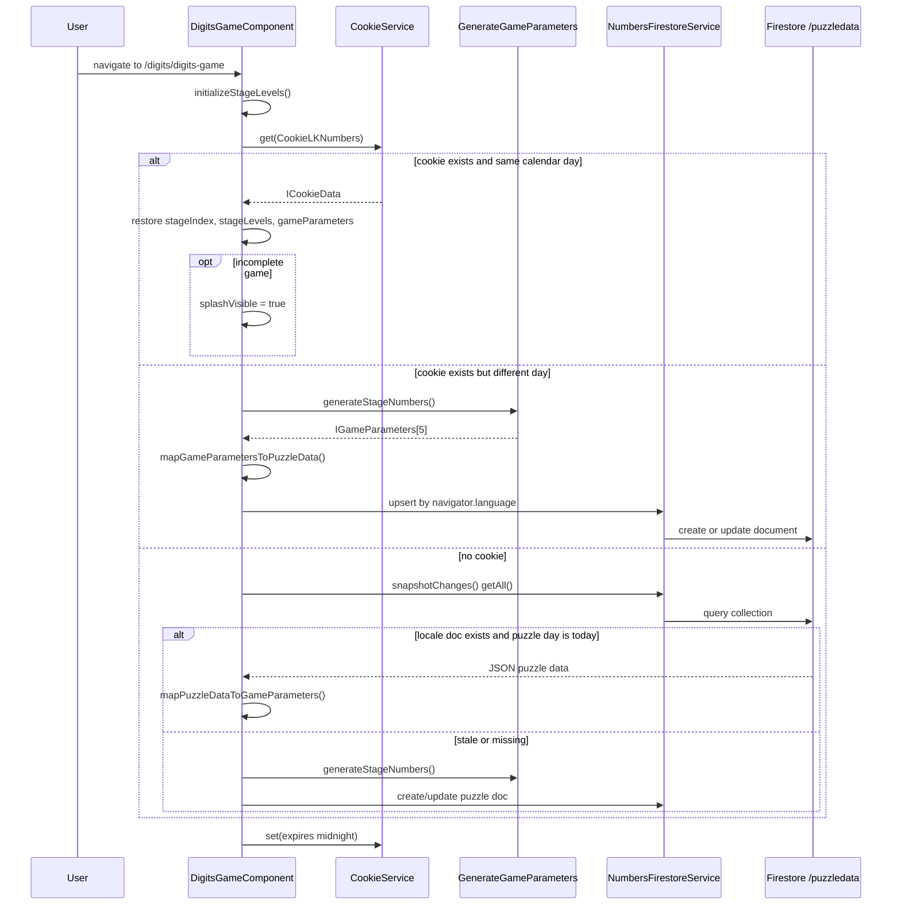

---

### GameArithmeticOperationsComponent — operation flow

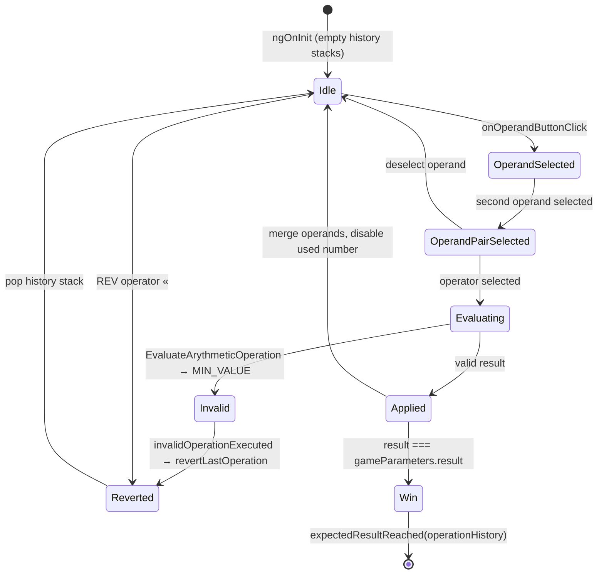

**Stacks inside `GameArithmeticOperationsComponent`:**

- `history: Stack<IGameParameters>` — snapshots for undo (`«` revert).
- `operationHistory: Stack<IGameOperation>` — ordered list of executed ops for victory summary.

---

### Services

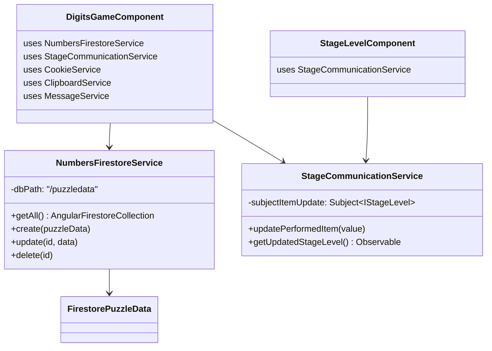

| Service | Scope | Role |
|---------|-------|------|
| **NumbersFirestoreService** | root + module | CRUD on Firestore collection `/puzzledata`; stores locale-keyed JSON puzzle payloads |
| **StageCommunicationService** | root | RxJS `Subject` bridge when a stage tab is clicked (observed in `DigitsGameComponent`) |

---

### Domain models (Digits)

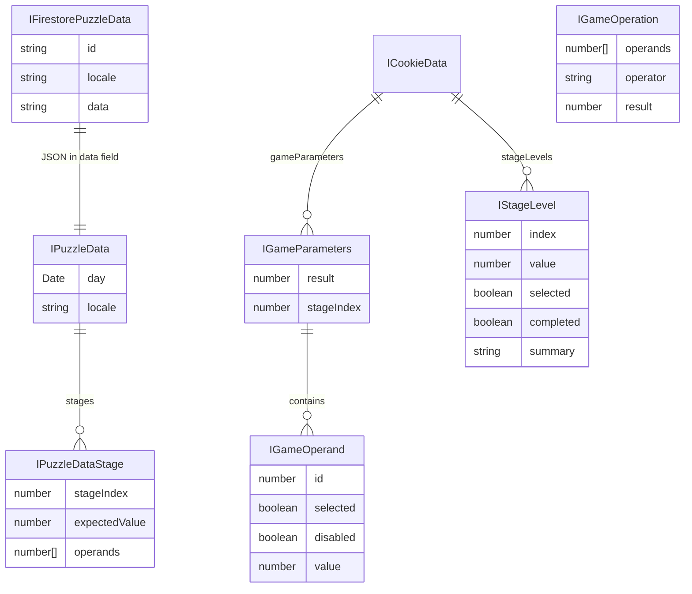

**Implementation classes:** `GameParameters`, `GameOperand`, `StageLevel`, `PuzzleData`, `PuzzleDataStage`, `FirestorePuzzleData`, `CookieData`, `GameOperation`, `Stack<T>`.

**Interfaces:** mirror models (`IGameParameters`, `IGameOperand`, `IStageLevel`, etc.) plus `IStack<T>`.

---

### Utilities and constants

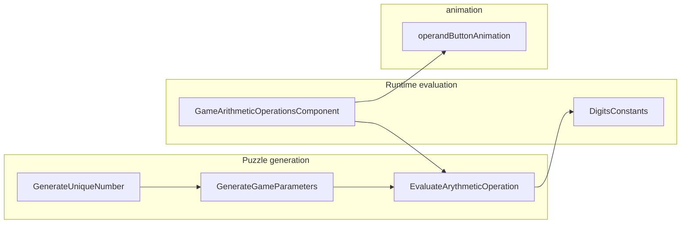

| File | Purpose |
|------|---------|
| `digits-constants.ts` | Operator symbols: `«`, `+`, `-`, `×`, `/` |
| `generate-unique-number.ts` | Non-repeating random integers in a range |
| `generate-game-parameters.ts` | Builds 5 stages: random operands per difficulty band, simulates valid ops to derive target, sorts stages by ascending target |
| `evaluate-arythmetic-operation.ts` | Static `evaluate()` and `cloneGameParameters()`; invalid sub/div returns `Number.MIN_VALUE` |
| `operand-button-animation.ts` | Angular animation trigger on operand buttons |

**Stage difficulty (GenerateGameParameters):** operand ranges and target bounds tighten per `stageIndex` (0–4); results sorted ascending so stage tabs show increasing targets.

---

### Persistence model

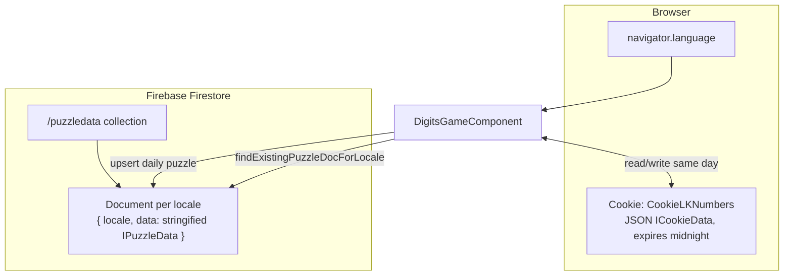

- **Cookie** — fast same-day resume (stage progress, parameters, completion flag).
- **Firestore** — shared daily puzzle per locale; `findExistingPuzzleDocForLocale` matches exact tag or primary language subtag.
- **Clipboard** — stage/all-stage operation summaries via `ngx-clipboard`.

---

### Digits file map

```
src/app/digits/
├── digits.module.ts
├── digits-routing.module.ts
├── digits-game.component.{ts,html,scss}
├── digits-constants.ts
├── generate-game-parameters.ts
├── generate-unique-number.ts
├── digit-styles.scss
├── components/
│   ├── game-stage-levels/
│   ├── stage-level/
│   └── game-arithmetic-operations/
│       ├── evaluate-arythmetic-operation.ts
│       └── operand-button-animation.ts
├── models/          # interfaces + model classes (puzzle, game, cookie, stack)
└── services/
    ├── numbers-firestore.service.ts
    └── stage-communication.service.ts
```

---

## Source layout (full app)

```
src/
├── main.ts                    # bootstrapApplication + providers
├── app/
│   ├── app.component.ts
│   ├── app-routing.module.ts
│   ├── layout/                # portfolio shell (home, about, awards)
│   ├── layout-pages/          # routed page components
│   ├── angular-news/          # news shell + lazy news pages
│   ├── angular-news-pages/
│   ├── digits/                # numbers puzzle (see above)
│   ├── material-examples/
│   ├── playground/
│   ├── shared/                # header, sidenav, checklist, error services
│   ├── error/
│   └── not-found/
├── assets/                    # icons, logos, CV PDF
├── environments/              # Firebase config (prod/dev)
└── styles/
```

---

## Development server

Run `pnpm start` or `ng serve`. Navigate to `http://localhost:4200/`. The app uses hash routing (`#/...`).

Run `pnpm lint` to execute ESLint via the flat config.

## Code scaffolding

Run `ng generate component component-name` to generate a new component. You can also use `ng generate directive|pipe|service|class|guard|interface|enum|module`.

## Build

Run `ng build` to build the project. Artifacts go to `dist/`.

Production GitHub Pages build:

```bash
pnpm gitbuild   # ng build --configuration production --base-href /LKovariHome/
pnpm gitdeploy  # gh-pages -d dist
```

## Running unit tests

Run `ng test` to execute unit tests via [Karma](https://karma-runner.github.io).

## Running end-to-end tests

Run `ng e2e` to execute end-to-end tests via a platform of your choice. To use this command, you need to first add a package that implements end-to-end testing capabilities.

## Further help

To get more help on the Angular CLI use `ng help` or go check out the [Angular CLI Overview and Command Reference](https://angular.io/cli) page.

---

## Upgrade

The project is on **Angular 22.0.4**; the v21 → v22 upgrade and codemods are complete (see [Result](#result)).

### v21 → v22

Angular ships **codemods** (automated refactors) with each major release. After bumping `@angular/*` packages to v22, the codebase must be updated to match new defaults and breaking changes.

The usual path is:

```bash
ng update @angular/core@22 @angular/cli@22
```

That can fail or skip migrations when dependency trees are complex (for example `@angular/fire`, PrimeNG, or legacy Flex Layout), the git working tree is dirty, or `ng update` does not run every named migration reliably.

This repo includes a **manual, one-time migration runner** that applies all official Angular v22 codemods in a fixed order. It is **not** part of `start`, `build`, `test`, CI, or deployment — only a developer runs it during the upgrade.

#### Run the migrations

1. Install dependencies: `pnpm install`
2. Run: `pnpm run migrate:angular-v22`

That executes `scripts/run-v22-migrations-direct.cjs`, which loads migration schematics directly from `node_modules` and writes file changes to the workspace. After it finishes, review the diff and commit.

#### Migrations applied

| Package | Migration | Typical changes |
|---------|-----------|-----------------|
| `@angular/core` | `change-detection-eager` | Adds `changeDetection: ChangeDetectionStrategy.Eager` to components |
| `@angular/core` | `http-xhr-backend` | Updates HTTP test setup to `provideHttpClient(withXhr())` in `src/test.ts` |
| `@angular/core` | `strict-templates-default` | Enables `strictTemplates: true` in `tsconfig.json` |
| `@angular/core` | `can-match-snapshot-required` | Route guard / `canMatch` API updates where applicable |
| `@angular/core` | `incremental-hydration` | SSR/hydration-related updates where applicable |
| `@angular/core` | `strict-safe-navigation-narrow` | Template strictness for safe navigation |
| `@angular/core` | `model-output` | `model()` input/output API updates where applicable |
| `@angular/core` | `safe-optional-chaining` | Template optional-chaining strictness updates |
| `@angular/cli` | `add-istanbul-instrumenter` | Karma coverage / `istanbul-lib-instrument` dev dependency alignment |
| `@angular/cli` | `update-workspace-config` | Updates `tsconfig.*.json`, `angular.json`, and related workspace files |

#### Migration scripts in `scripts/`

| File | Role |
|------|------|
| `run-v22-migrations-direct.cjs` | **Used by `pnpm run migrate:angular-v22`.** Invokes `@angular/core` and `@schematics/angular` migration bundles via Angular DevKit, without going through the CLI. |
| `run-v22-migrations.mjs` | Alternative: loops `ng update @angular/core@22 --name <migration> --allow-dirty` (and the same for `@angular/cli`). Not wired in `package.json`. |
| `run-v22-migrations-via-ng.mjs` | Same as `run-v22-migrations.mjs`; kept as an alternate CLI-based runner. Not wired in `package.json`. |

Use the direct `.cjs` script when `ng update` is unreliable. Use an `.mjs` variant only if you prefer the CLI path and want to run it manually with `node scripts/run-v22-migrations.mjs`.

#### After upgrading

- Run `pnpm build` and `pnpm test` to verify the tree.
- Resolve any remaining peer-dependency or third-party library issues by hand (`ng update` alone rarely fixes all of them).
- You do not need to run `migrate:angular-v22` again unless you reset the repo or repeat the v21 → v22 upgrade on another branch.
- See [Result](#result) for post-upgrade verification output.

### Result

Post-upgrade verification on **2026-06-26** (Angular **22.0.4**, package manager **pnpm**).

#### `npm outdated`

> **Note:** `npm outdated` was run against a pnpm workspace. The warnings about `node-linker` and `public-hoist-pattern` come from pnpm-specific settings in `.npmrc` — they are expected when using npm instead of pnpm. Prefer `pnpm outdated` in this repo.

For several `@angular/*` packages, **Current (22.0.4) is newer than Latest** in the registry column. That is normal while npm's "latest" tag still points at Angular 21; the project is intentionally on v22.

```
$ npm outdated
npm warn Unknown project config "node-linker". This will stop working in the next major version of npm.
npm warn Unknown project config "public-hoist-pattern". This will stop working in the next major version of npm.

Package                              Current   Wanted   Latest  Location
@angular/animations                   22.0.4   22.0.4   20.1.8  node_modules/@angular/animations
@angular/build                        22.0.4   22.0.4  21.2.17  node_modules/@angular/build
@angular/cli                          22.0.4   22.0.4  21.2.17  node_modules/@angular/cli
@angular/common                       22.0.4   22.0.4  21.2.17  node_modules/@angular/common
@angular/compiler                     22.0.4   22.0.4  21.2.17  node_modules/@angular/compiler
@angular/compiler-cli                 22.0.4   22.0.4  21.2.17  node_modules/@angular/compiler-cli
@angular/core                         22.0.4   22.0.4  21.2.17  node_modules/@angular/core
@angular/forms                        22.0.4   22.0.4  21.2.17  node_modules/@angular/forms
@angular/platform-browser             22.0.4   22.0.4  21.2.17  node_modules/@angular/platform-browser
@angular/platform-browser-dynamic     22.0.4   22.0.4   20.0.7  node_modules/@angular/platform-browser-dynamic
@angular/router                       22.0.4   22.0.4  21.2.17  node_modules/@angular/router
@eslint/js                            9.39.4   9.39.4   10.0.1  node_modules/@eslint/js
@fortawesome/fontawesome-svg-core      6.7.2    6.7.2    7.3.0  node_modules/@fortawesome/fontawesome-svg-core
@fortawesome/free-brands-svg-icons     6.7.2    6.7.2    7.3.0  node_modules/@fortawesome/free-brands-svg-icons
@fortawesome/free-regular-svg-icons    6.7.2    6.7.2    7.3.0  node_modules/@fortawesome/free-regular-svg-icons
@fortawesome/free-solid-svg-icons      6.7.2    6.7.2    7.3.0  node_modules/@fortawesome/free-solid-svg-icons
@primeuix/styles                       1.2.5    1.2.5    2.0.3  node_modules/@primeuix/styles
@primeuix/utils                        0.6.4    0.6.4    0.7.2  node_modules/@primeuix/utils
@schematics/angular                   22.0.4   22.0.4  21.2.17  node_modules/@schematics/angular
@types/jasmine                        5.1.15   5.1.15    6.0.0  node_modules/@types/jasmine
eslint                                9.39.4   9.39.4   10.6.0  node_modules/eslint
firebase                             11.10.0  11.10.0  12.15.0  node_modules/firebase
jasmine-core                           5.1.2    5.1.2    6.3.0  node_modules/jasmine-core
karma-jasmine-html-reporter            2.1.0    2.1.0    2.2.0  node_modules/karma-jasmine-html-reporter
```

**Summary:** Angular packages are pinned at **22.0.4** and match **Wanted**. Optional future major bumps (not required for v22): ESLint 10, Font Awesome 7, Firebase 12, Jasmine 6, `@primeuix/styles` 2.x.

#### `ng update`

```
$ ng update
Using package manager: pnpm
Collecting installed dependencies...
Found 647 dependencies.
    We analyzed your package.json and everything seems to be in order. Good work!
```

**Conclusion:** The v21 → v22 upgrade and migrations are complete; no further Angular CLI updates are pending.

---

## Known bugs and/or To Do List

- Generating index html...1 rules skipped due to selector errors: legend+\* -> Cannot read property 'type' of undefined
- set to true : "strictPropertyInitialization": false,
- use date pipe at lastUpdateDate
- Digits: share copy to clipboard does not work reliably
- Digits: Firestore locale query could use dedicated queries instead of full collection scan

## Would be good or better

- hidden side nav when press the hamburger (menu) icon floating above the content, instead of shift right the content

## Original values which changed.

-1. angular.json production build
"maximumWarning": "500kb",
"maximumError": "1mb"

-2. angular.json below the production added
"optimization": {
"scripts": true,
"styles": {
"minify": true,
"inlineCritical": false
},
"fonts": true
},
to eliminate the following warning
Generating index html...1 rules skipped due to selector errors: legend+\* -> Cannot read property 'type' of undefined

-3. angular.json architect\build\options\styles
replaced "node_modules/bootstrap/scss/bootstrap.css" with "node_modules/bootstrap/scss/bootstrap.scss",

-4. added "preserveSymlinks": true, to prevent:
main.ts:11 ERROR Error: NG0203: inject() must be called from an injection context such as a constructor, a factory function, a field initializer, or a function used with `runInInjectionContext`. Find more at https://angular.io/errors/NG0203

## Deployed to https://lkovari.github.io/LKovariHome
