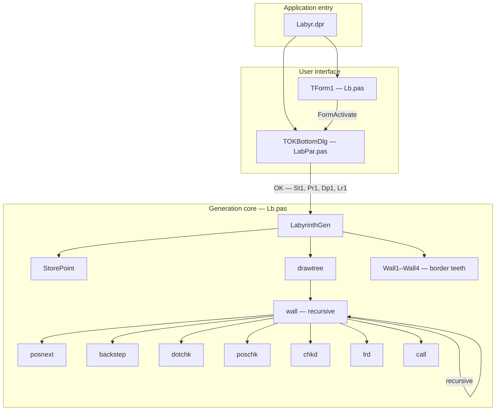
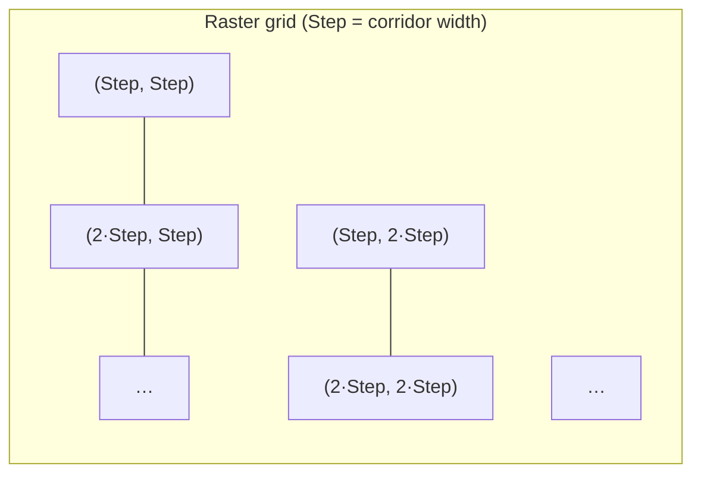
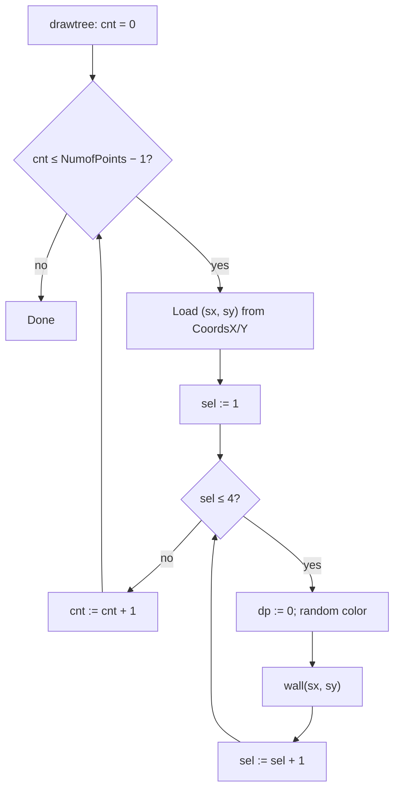
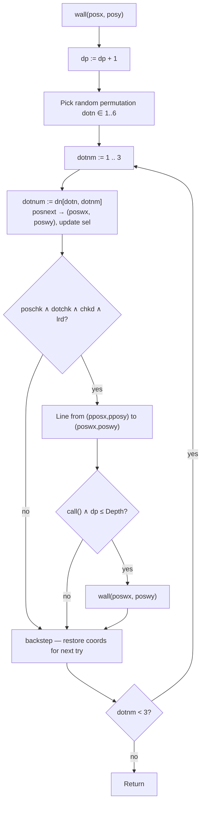
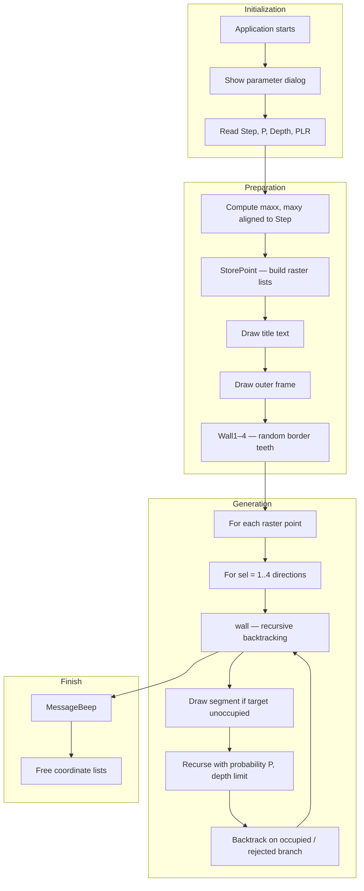

# Labyrinth Generator — Technical Documentation

**Author:** L. Kovári  
**Original algorithm:** 1991 (`LABYR.PAS`, DOS / BGI graphics)  
**Delphi Windows port:** November 1998 (`Labyr.dpr`, `Lb.pas`, `LabPar.pas`)

This document describes how the Delphi labyrinth generator works: how it builds a raster grid, how corridors are drawn with recursive backtracking, and how the supporting modules fit together.

---

## Overview

The program generates a **perfect maze-like labyrinth** on a form canvas. The maze area is aligned to a fixed **corridor width** (`Step`). All corridor junctions lie on a regular grid of raster points spaced `Step` pixels apart.

From each raster point, the algorithm attempts to grow corridor segments in four global directions (up, down, left, right). Growth uses a **recursive backtracking** procedure that only draws a segment when the target raster point is still unoccupied. If a point is already used, that branch is skipped and the search steps back to try another direction.

The result is a connected network of orthogonal corridors with no overlapping junctions.

---

## Project Structure



| File | Role |
|------|------|
| `Labyr.dpr` | Program entry; creates main form and parameter dialog |
| `Lb.pas` | Main form, labyrinth generation (`LabyrinthGen`), recursive `wall` algorithm |
| `LabPar.pas` | Modal dialog for `Step`, probability, depth, and lateral-branch settings |
| `LABYR.PAS` | Earlier 1991 DOS version (same algorithm, BGI `getpixel` / `line`) |
| `Snake.pas` | Unrelated Snake game with a different maze algorithm (recursive division) |

---

## Startup and Parameters

On first activation of the main form:

1. The parameter dialog (`OKBottomDlg`) is shown modally.
2. The user sets four values, stored in global variables `St1`, `Pr1`, `Dp1`, `Lr1`:

| Parameter | Variable | Meaning | Typical range |
|-----------|----------|---------|---------------|
| **Step** | `St1` | Corridor width in pixels; grid spacing | 1–100 (default from spin edit) |
| **Probability (P)** | `Pr1` | Chance to recurse after drawing a segment | 1–100 |
| **Depth** | `Dp1` | Maximum recursion depth per tree | 1–1000 |
| **Left/Right probability (PLR)** | `Lr1` | Chance to allow lateral branches relative to travel direction | 1–100 |

3. `LabyrinthGen(St1, Pr1, Dp1, Lr1)` runs on the form canvas.

---

## Maze Area and Raster Grid

The drawable maze region is sized so every side is an integer multiple of `Step`.

```
maxx = Form1.Width  - Step
maxy = Form1.Height - Step
```

Effective maze bounds:

- Width: `trunc(maxx / Step) * Step`
- Height: `trunc(maxy / Step) * Step`

### Raster point matrix (`StorePoint`)

`StorePoint` builds the list of all grid nodes:

- X from `Step` to `(trunc(maxx/Step)*Step) - Step`, step `Step`
- Y from `Step` to `(trunc(maxy/Step)*Step) - Step`, step `Step`

Each `(x, y)` pair is stored in parallel `TStringList` instances `CoordsX` and `CoordsY`. The count is `NumofPoints`.

Conceptually this is an `(cols × rows)` matrix of junction candidates:



Adjacent raster points are exactly `Step` pixels apart horizontally or vertically — one corridor length.

---

## Border and Frame

Before generation:

1. A blue outer frame is drawn along the aligned maze rectangle (pen width 6, then 2).
2. Procedures `Wall1`–`Wall4` add random short segments (“teeth”) along each border side. At each `Step` position along a wall, a random value `j = Random(10)` draws a short inward segment when `j = 7` (~10% chance). This breaks uniform borders and creates occasional border openings.

---

## Generation Loop (`drawtree`)

For **every** raster point and **each of four starting directions** (`sel` = 1..4):

| `sel` | Starting direction |
|-------|-------------------|
| 1 | Up |
| 2 | Down |
| 3 | Left |
| 4 | Right |

The procedure:

1. Resets depth counter `dp := 0`
2. Picks a random pen color (not white)
3. Calls `wall(sx, sy)` from that point and direction

So each grid node can seed up to four oriented trees (one per compass direction).



---

## Recursive Backtracking (`wall`)

`wall(posx, posy)` grows an **oriented tree**: from the current heading, only **left**, **forward**, and **right** relative turns are tried — never straight backward. This matches the 1991 design comment: the tree drawer builds directed branches, not undirected graphs.

### Direction model

Global directions (`sel` / `fd`):

- 1 = Up  
- 2 = Down  
- 3 = Left  
- 4 = Right  

At each recursive call, `sel` holds the current travel direction. `fd` is the **original** starting direction for that tree (set before `wall` is called); it is used by `chkd` to forbid immediate U-turns relative to the seed direction.

### Random turn order

Array `dn[1..6, 1..3]` holds all six permutations of `(1, 2, 3)`:

- 1 = try left relative to current heading  
- 2 = try forward  
- 3 = try right  

A random integer `dotn` in 1..6 selects which permutation orders the three attempts at each node.

### One `wall` invocation



### Helper functions

| Function | Purpose |
|----------|---------|
| `posnext` | From current position, heading, and relative turn code, compute next raster coordinates and new heading |
| `backstep` | Undo the coordinate move after a failed or completed branch attempt so the next relative direction is evaluated from the same node |
| `poschk` | True if `(xx, yy)` is inside canvas bounds |
| `dotchk` | True if `Canvas.Pixels[px,py] = clWhite` — no corridor endpoint yet at that pixel |
| `chkd(d)` | False if `d` is opposite to original direction `fd` (prevents backward growth along the seed axis) |
| `lrd(ss)` | Random gate for lateral (left/right) moves; `Random(101) < PLR` must hold when turning sideways |
| `call` | `Random(100) ≤ P` — stochastic decision whether to recurse deeper |

### Occupancy rule (core invariant)

A corridor may be drawn only if the **target raster point** is still background (white). Once a line is drawn, pixels along the segment are no longer white, so another branch cannot claim the same junction. Competing paths **backtrack** and try another permutation entry or parent direction.

This is the practical backtracking step: not a separate stack structure, but “if occupied, skip draw and backstep.”

### Depth and probability

Recursion continues only when:

- `call` returns true (`Random(100) ≤ P`), and  
- `dp ≤ Depth`

Together, `P` and `Depth` control how bushy and deep each oriented tree becomes. Low `P` or low `Depth` yields sparser mazes; high values fill more of the grid.

---

## Coordinate Helpers in Detail

### `posnext`

Maps relative turn `dto` ∈ {1,2,3} (left, forward, right) from current heading `sl` to:

- New pixel coordinates `(pwx, pwy)` one `Step` away on the grid  
- Updated heading in `sl`  
- Previous heading saved in `ls` (used by `backstep`)

Example when heading is **Up** (`sl = 1`):

| `dto` | Relative | New heading | Movement |
|-------|----------|-------------|----------|
| 1 | Left | Left (3) | `ox - Step, oy` |
| 2 | Forward | Up (1) | `ox, oy - Step` |
| 3 | Right | Right (4) | `ox + Step, oy` |

Analogous tables exist for Down, Left, and Right in `Lb.pas`.

### `backstep`

Reverses the virtual move made by `posnext` for the branch just attempted, restoring `(poswx, poswy)` to the parent `(pposx, pposy)` side effects before the next `dotnm` iteration. Heading `sel` is reset to `lastsel`.

---

## End-to-End Processing Flow



---

## Algorithm Properties

**Strengths**

- Simple occupancy test via canvas pixels — no explicit maze matrix required during carving  
- Raster alignment guarantees uniform corridor width and orthogonal walls  
- Random permutation of turn order produces varied maze topology  
- `PLR` biases growth forward vs. sideways for more “tunnel-like” or “branchy” aesthetics  

**Limitations**

- Pixel-based occupancy is sensitive to pen width and antialiasing (1998 code assumes crisp integer coordinates)  
- Four oriented trees per node can overdraw shared corridors (same segment from opposite seeds) but junction conflicts are still prevented by `dotchk`  
- No guarantee of full maze connectivity or single unique path between arbitrary cells — the aesthetic is labyrinth-like rather than a strict spanning tree of all cells  

---

## Relation to `LABYR.PAS` (1991)

The DOS program implements the same `wall` / `posnext` / `backstep` / `dotchk` logic using BGI:

- `dotchk` uses `getpixel(px,py) = backgr`  
- `drawtree` picks **random** raster points until a key is pressed (interactive screensaver style)  
- Command-line: `LABYR Step P Depth PLR`  

The 1998 Delphi port replaces random point selection with **exhaustive traversal** of all raster points and adds the parameter dialog, border teeth, and form canvas rendering.

---

## Suggested Build Context

- Target: Delphi VCL (references `Forms`, `TSpinEdit`, `TStringList`, etc.)  
- Form resources (`*.dfm`) are referenced but may need to be recreated if missing from the archive  
- Default run parameters in `lab.cmd`: Step=7, P=70, Depth=700, PLR=70  

---

## Quick Reference — Key Globals in `Lb.pas`

| Symbol | Meaning |
|--------|---------|
| `Step` | Corridor width / grid spacing |
| `P` | Recursion probability threshold |
| `Depth` | Max recursion depth |
| `PLR` | Lateral branch probability threshold |
| `dp` | Current recursion depth in `wall` |
| `sel` | Current travel direction (1–4) |
| `fd` | Seed direction for current tree |
| `dn[6,3]` | Six turn-order permutations |
