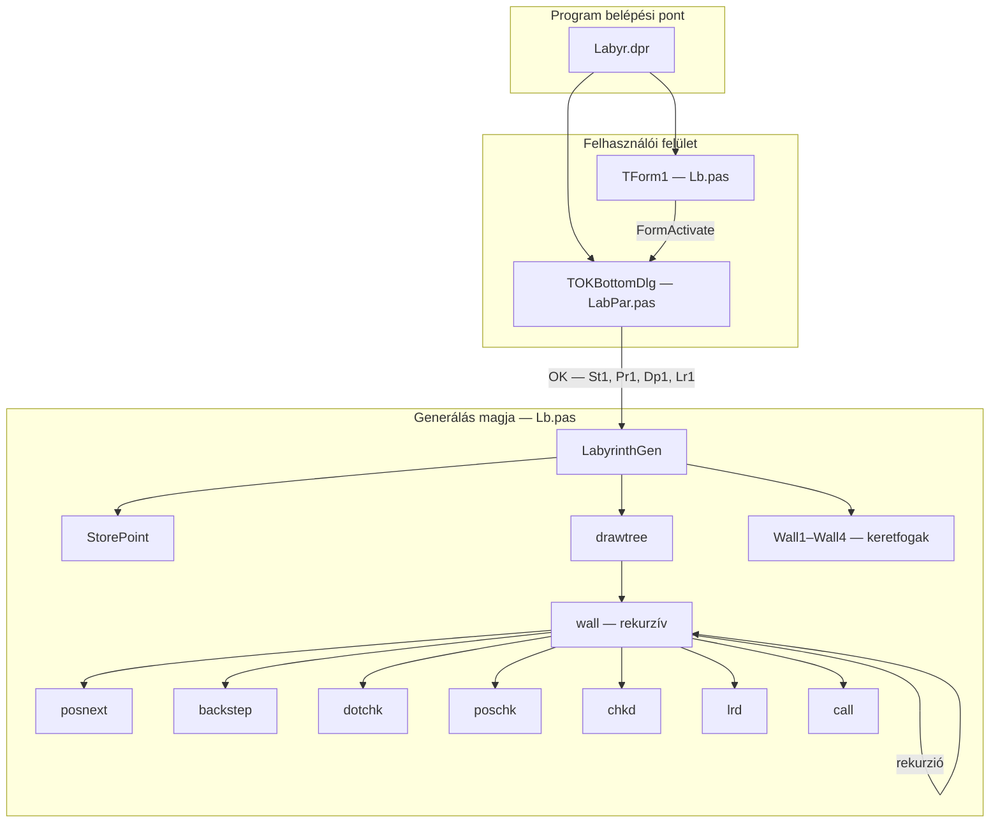
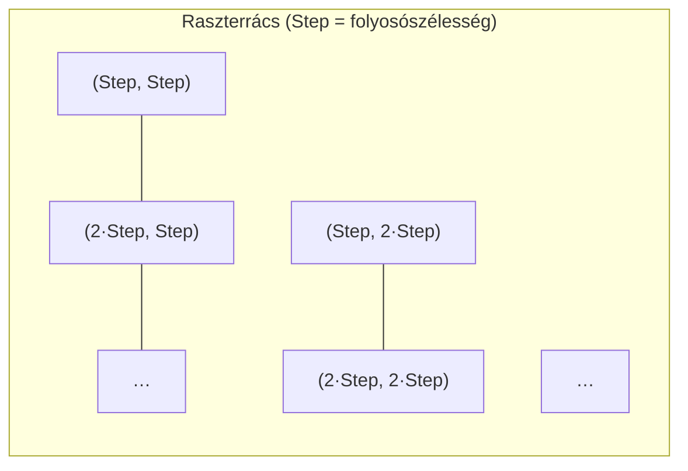
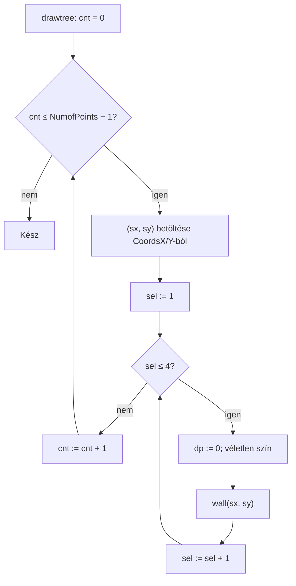
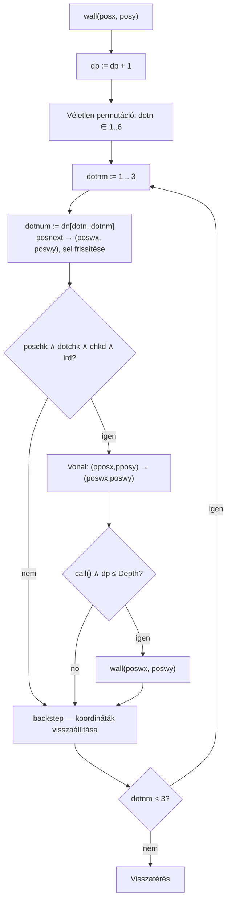
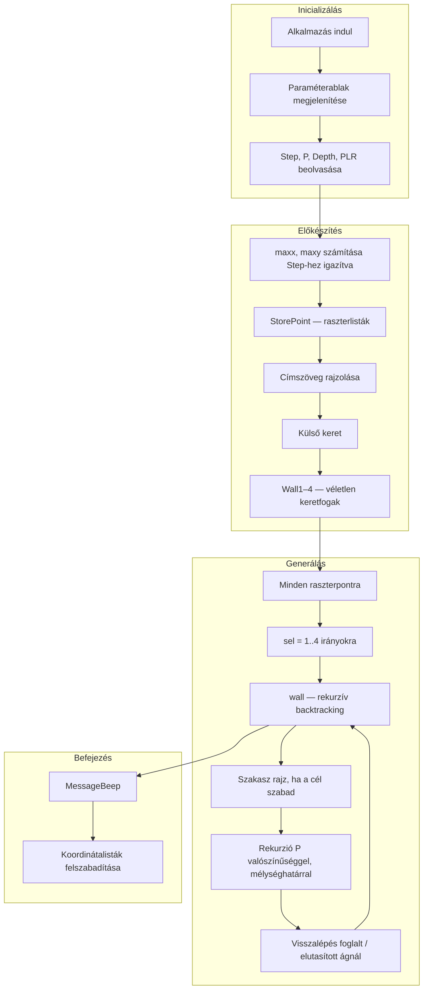

# Labirintus-generátor — Technikai dokumentáció

**Szerző:** L. Kovári  
**Eredeti algoritmus:** 1991 (`LABYR.PAS`, DOS / BGI grafika)  
**Delphi Windows port:** 1998. november (`Labyr.dpr`, `Lb.pas`, `LabPar.pas`)

Ez a dokumentum leírja a Delphi labirintus-generátor működését: a raszterpont-mátrix felépítését, a rekurzív visszalépéses (backtracking) folyosórajzolást, és a modulok felépítését.

---

## Áttekintés

A program **labirintusszerű** ábrát rajzol egy űrlap vásznára. A labirintus területe egy rögzített **folyosószélességhez** (`Step`) igazodik. Minden csomópont a raszter pontjain helyezkedik el, amelyek `Step` pixel távolságra vannak egymástól.

Minden raszterpontból a program négy globális irányban (fel, le, bal, jobb) próbál folyosószakaszokat növeszteni. A növekedés **rekurzív visszalépéses** algoritmust használ: csak akkor húz vonalat a következő raszterpontig, ha az a pont még szabad. Ha a pont már foglalt, az ág kimarad, és az algoritmus visszalép egy másik irány kipróbálásához.

Az eredmény ortogonális folyosókból álló háló, ahol a csomópontokon nincs átfedés.

---

## Projektstruktúra



| Fájl | Szerep |
|------|--------|
| `Labyr.dpr` | Program belépési pont; fő űrlap és paraméterablak létrehozása |
| `Lb.pas` | Fő űrlap, labirintus-generálás (`LabyrinthGen`), rekurzív `wall` algoritmus |
| `LabPar.pas` | Modális párbeszédablak: `Step`, valószínűség, mélység, oldalirányú ágak |
| `LABYR.PAS` | Korábbi 1991-es DOS változat (ugyanaz az algoritmus, BGI `getpixel` / `line`) |
| `Snake.pas` | Kapcsolódó Kígyó játék más labirintus-algoritmussal (rekurzív felosztás) |

---

## Indítás és paraméterek

A fő űrlap első aktiválásakor:

1. Megjelenik a paraméterablak (`OKBottomDlg`).
2. A felhasználó négy értéket állít be; ezek a `St1`, `Pr1`, `Dp1`, `Lr1` globális változókba kerülnek:

| Paraméter | Változó | Jelentés | Tipikus tartomány |
|-----------|---------|----------|-------------------|
| **Step** | `St1` | Folyosó szélessége pixelben; rács távolsága | 1–100 |
| **Valószínűség (P)** | `Pr1` | Esély a rekurzív továbbhaladásra egy szakasz rajzolása után | 1–100 |
| **Mélység (Depth)** | `Dp1` | Maximális rekurziós mélység fánként | 1–1000 |
| **Bal/jobb valószínűség (PLR)** | `Lr1` | Esély az oldalirányú (balra/jobbra) ág engedélyezésére | 1–100 |

3. `LabyrinthGen(St1, Pr1, Dp1, Lr1)` lefut a vásznon.

---

## Labirintus terület és raszterpont-mátrix

A rajzolható terület minden oldala a `Step` egész többszöröse.

```
maxx = Form1.Width  - Step
maxy = Form1.Height - Step
```

Tényleges labirintus határok:

- Szélesség: `trunc(maxx / Step) * Step`
- Magasság: `trunc(maxy / Step) * Step`

### Raszterpont-mátrix (`StorePoint`)

A `StorePoint` elkészíti az összes rácspont listáját:

- X: `Step`-től `(trunc(maxx/Step)*Step) - Step`-ig, `Step` lépésközzel
- Y: `Step`-től `(trunc(maxy/Step)*Step) - Step`-ig, `Step` lépésközzel

Minden `(x, y)` pár párhuzamos `TStringList` listákba kerül (`CoordsX`, `CoordsY`). A pontok száma: `NumofPoints`.

Fogalmi szinten ez egy `(oszlop × sor)` csomópontmátrix:



A szomszédos raszterpontok vízszintesen vagy függőlegesen pontosan `Step` pixel távolságra vannak — egy folyosóhossznyi távolság.

---

## Keret és szegély

Generálás előtt:

1. Kék külső keret rajzolódik az igazított téglalap mentén (toll vastagság 6, majd 2).
2. A `Wall1`–`Wall4` eljárások véletlenszerű rövid szakaszokat („fogakat”) rajzolnak mind a négy oldalon. Minden `Step` pozíciónál `j = Random(10)`; ha `j = 7` (~10% esély), egy rövid befelé mutató szakasz készül. Ez megtöri az egyenletes keretet és alkalmanként nyílást ad a szegélyen.

---

## Generálási ciklus (`drawtree`)

**Minden** raszterpontra és **mind a négy kezdőirányra** (`sel` = 1..4):

| `sel` | Kezdőirány |
|-------|------------|
| 1 | Fel |
| 2 | Le |
| 3 | Bal |
| 4 | Jobb |

A folyamat:

1. Mélységszámláló nullázása: `dp := 0`
2. Véletlen tollszín választása (nem fehér)
3. `wall(sx, sy)` hívása az adott pontból és irányból

Tehát minden rácspontból legfeljebb négy irányított fa indulhat.



---

## Rekurzív visszalépés (`wall`)

A `wall(posx, posy)` **irányított fát** növeszt: az aktuális haladási irányhoz képest csak **balra**, **előre** és **jobbra** próbál fordulni — soha nem hátra. Ez megfelel az 1991-es forráskód leírásának: irányított fa, nem irányítatlan gráf.

### Iránymodell

Globális irányok (`sel` / `fd`):

- 1 = Fel  
- 2 = Le  
- 3 = Bal  
- 4 = Jobb  

Minden rekurzív hívásnál `sel` az aktuális haladási irány. `fd` a fa **eredeti** kezdőiránya (a `wall` hívása előtt állítódik be); a `chkd` ezt használja, hogy megakadályozza az azonnali visszafordulást a magirány mentén.

### Véletlen fordulási sorrend

A `dn[1..6, 1..3]` tömb a `(1, 2, 3)` hat permutációját tartalmazza:

- 1 = balra az aktuális irányhoz képest  
- 2 = előre  
- 3 = jobbra  

A `dotn` véletlen egész (1..6) kiválasztja, milyen sorrendben próbálja a három irányt az adott csomóponton.

### Egy `wall` hívás lépései



### Segédfüggvények

| Függvény | Feladat |
|----------|---------|
| `posnext` | Aktuális pozícióból, irányból és relatív forduló kódból kiszámolja a következő raszter koordinátákat és az új irányt |
| `backstep` | Visszavonja a `posnext` virtuális lépését az aktuális ág kipróbálása után |
| `poschk` | Igaz, ha `(xx, yy)` a vászon határain belül van |
| `dotchk` | Igaz, ha `Canvas.Pixels[px,py] = clWhite` — még nincs folyosóvégpont ezen a pixelen |
| `chkd(d)` | Hamis, ha `d` ellentétes `fd`-del (visszafelé növekedés tiltása) |
| `lrd(ss)` | Oldalirányú ág véletlen kapuja; `Random(101) < PLR` kell teljesüljön |
| `call` | `Random(100) ≤ P` — sztochasztikus döntés a mélyebb rekurzióról |

### Foglaltsági szabály (alapinvariáns)

Folyosót csak akkor húzhat, ha a **cél raszterpont** még háttérszínű (fehér). A vonal megrajzolása után a szakasz pixelei már nem fehérek, így más ág nem foglalhatja ugyanazt a csomópontot. Az ütköző utak **visszalépnek** és más permutációs elem vagy szülőirány következik.

Ez a gyakorlati backtracking: nincs külön veremadatstruktúra, hanem „ha foglalt, kihagyás és backstep”.

### Mélység és valószínűség

A rekurzió csak akkor folytatódik, ha:

- `call` igaz (`Random(100) ≤ P`), és  
- `dp ≤ Depth`

A `P` és `Depth` együtt szabályozza, mennyire sűrű és mély lesz minden irányított fa. Alacsony értékeknél ritkább labirintus, magas értékeknél jobban kitöltött rács.

---

## Koordináta-segédek részletesen

### `posnext`

A relatív forduló `dto` ∈ {1,2,3} (balra, előre, jobbra) és az aktuális `sl` irány alapján:

- Új pixelkoordináták `(pwx, pwy)` egy `Step` távolságra  
- Frissített irány `sl`-ben  
- Előző irány `ls`-ben (a `backstep` használja)

Példa **Fel** irány (`sl = 1`) esetén:

| `dto` | Relatív | Új irány | Mozgás |
|-------|---------|----------|--------|
| 1 | Balra | Bal (3) | `ox - Step, oy` |
| 2 | Előre | Fel (1) | `ox, oy - Step` |
| 3 | Jobbra | Jobb (4) | `ox + Step, oy` |

Hasonló táblázatok vannak Le, Bal és Jobb irányokra is az `Lb.pas`-ban.

### `backstep`

Visszavonja az éppen kipróbált ág `posnext` lépését, mielőtt a következő `dotnm` iteráció indulna. A `sel` irány visszaáll `lastsel` értékére.

---

## Teljes feldolgozási folyamat



---

## Algoritmus tulajdonságai

**Erősségek**

- Egyszerű foglaltság-ellenőrzés pixelekkel — nincs szükség külön labirintus-mátrixra a faragás közben  
- Raszterigazítás egyenletes folyosószélességet és merőleges falakat biztosít  
- Véletlen fordulási permutáció változatos topológiát ad  
- A `PLR` előre-haladó és oldalirányú növekedés közötti egyensúlyt állít (járat-szerű vs. elágazó kinézet)  

**Korlátok**

- Pixelalapú foglaltság érzékeny a toll vastagságára és az élsimításra  
- Pontonként négy irányított fa ugyanazt a szakaszt többször is megrajzolhatja (ellenkező irányú indulások), de a csomópontütközést a `dotchk` megakadályozza  
- Nincs garancia teljes összefüggőségre vagy egyetlen útra tetszőleges cellák között — a kinézet labirintus-jellegű, nem szigorú feszítőfa minden cellára  

---

## Kapcsolat az `LABYR.PAS` (1991) verzióval

A DOS program ugyanazt a `wall` / `posnext` / `backstep` / `dotchk` logikát valósítja meg BGI-vel:

- `dotchk`: `getpixel(px,py) = backgr`  
- `drawtree`: **véletlen** raszterpontokból indul, billentyűig (képernyővédő jelleg)  
- Parancssor: `LABYR Step P Depth PLR`  

A 1998-as Delphi port a véletlen pontválasztást **teljes raszter bejárásra** cseréli, és hozzáadja a paraméterablakot, a keretfogakat és az űrlap-vászon rajzolást.

---

## Fordítási megjegyzések

- Cél: Delphi VCL (`Forms`, `TSpinEdit`, `TStringList`, stb.)  
- Az űrlap erőforrások (`*.dfm`) hivatkozva vannak; hiány esetén újra kell őket létrehozni  
- Alapértelmezett futtatási paraméterek a `lab.cmd`-ben: Step=7, P=70, Depth=700, PLR=70  

---

## Gyors referencia — fontos szimbólumok az `Lb.pas`-ban

| Szimbólum | Jelentés |
|---------|----------|
| `Step` | Folyosószélesség / rács távolsága |
| `P` | Rekurziós valószínűségi küszöb |
| `Depth` | Maximális rekurziós mélység |
| `PLR` | Oldalirányú ág valószínűségi küszöb |
| `dp` | Aktuális rekurziós mélység a `wall`-ban |
| `sel` | Aktuális haladási irány (1–4) |
| `fd` | A fa kezdőiránya |
| `dn[6,3]` | Hat fordulási sorrend permutációja |
